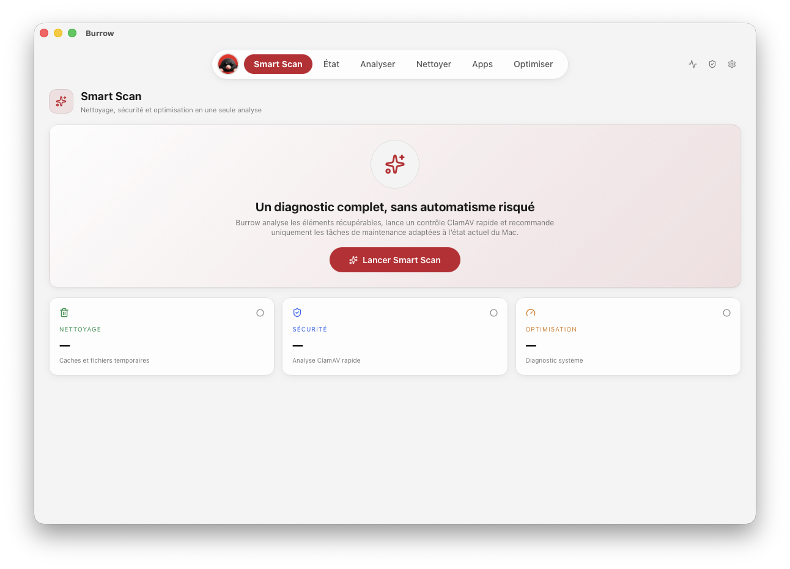
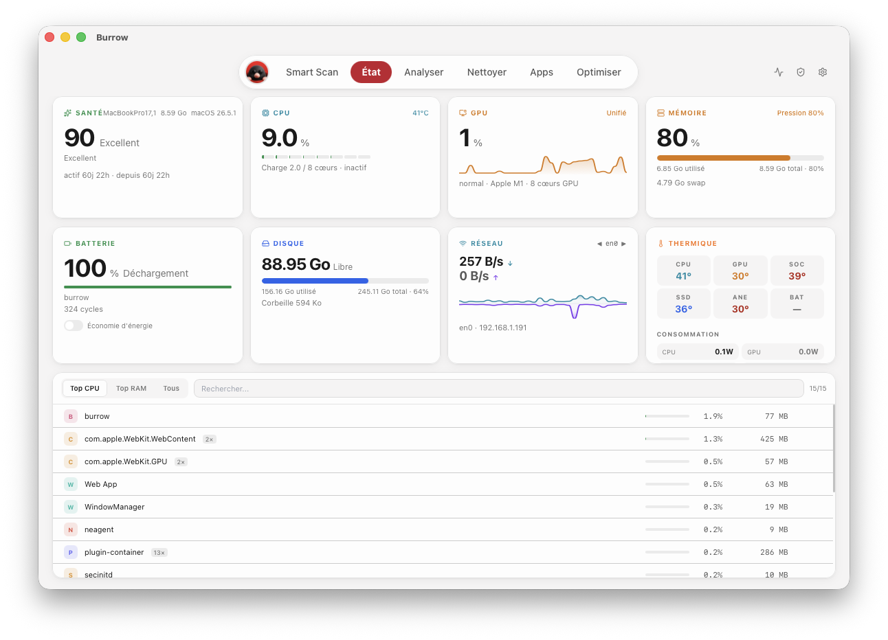
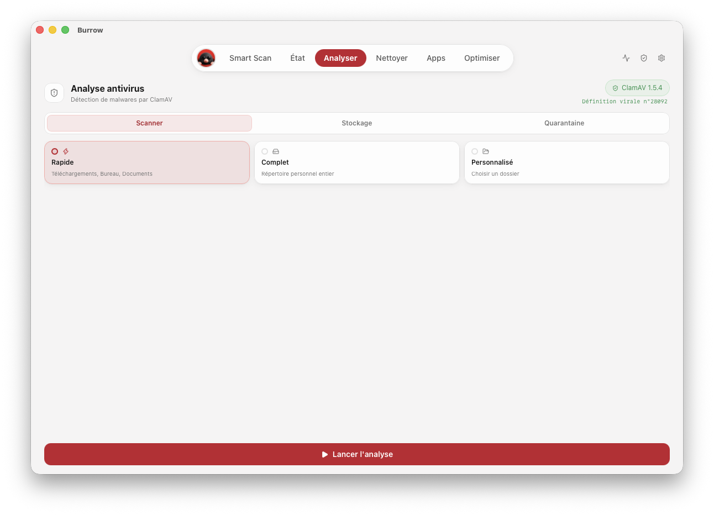
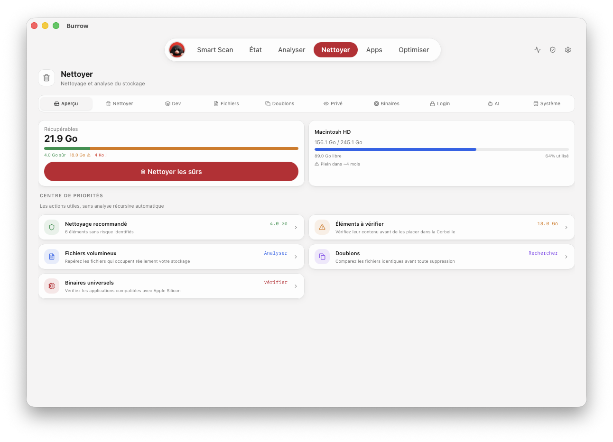
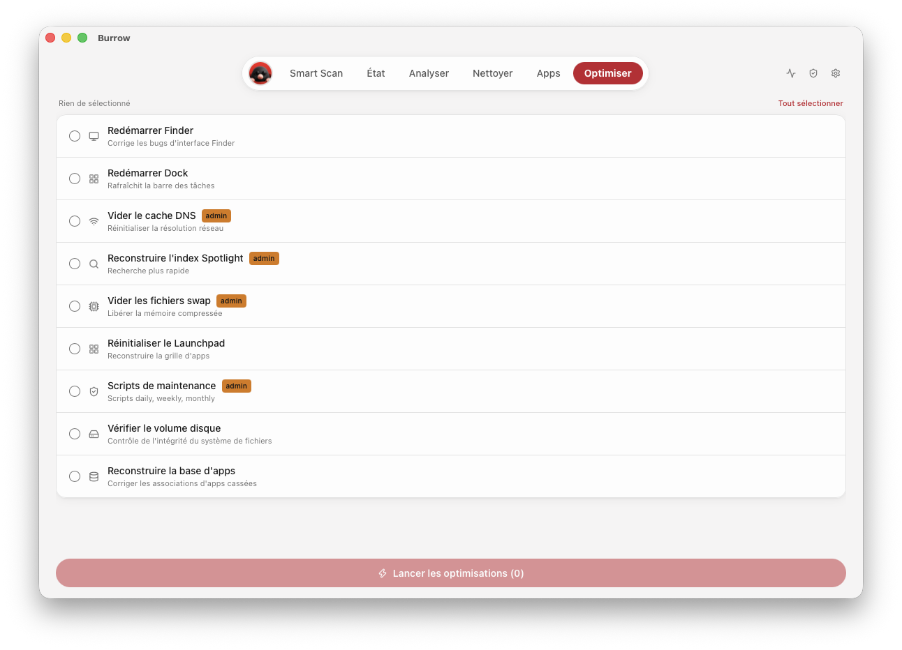
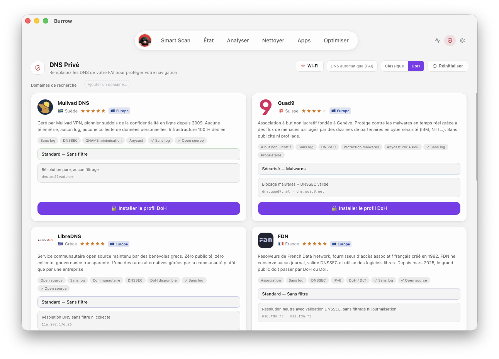

<div align="center">
  
  <h1>Burrow</h1>
  <p><strong>Your Mac, understood and under control.</strong></p>
  <p>
    A local-first cleaning, security and maintenance toolbox<br>
    designed from the ground up for Apple Silicon. 🐾
  </p>
  <p>
    <a href="https://github.com/Luffytnes/Burrow/actions/workflows/ci.yml"></a>
    
    
    
    
    <a href="LICENSE"></a>
  </p>
  <p>
    <a href="#-everything-your-mac-needs-in-one-place">Features</a> ·
    <a href="#-see-burrow-in-action">Screenshots</a> ·
    <a href="#-get-burrow">Get Burrow</a> ·
    <a href="PRIVACY.md">Privacy</a> ·
    <a href="SECURITY.md">Security</a> ·
    <a href="CONTRIBUTING.md">Contribute</a>
  </p>
</div>

<br>

<p align="center">
  
</p>
<p align="center">
  <sub>Cleanup, security and optimization — brought together in one guided Smart Scan.</sub>
</p>

---

## 📸 See Burrow in action

<table>
  <tr>
    <th width="50%">Live Status</th>
    <th width="50%">Malware Scan</th>
  </tr>
  <tr>
    <td></td>
    <td></td>
  </tr>
  <tr>
    <th>Smart Cleanup</th>
    <th>Selected Maintenance</th>
  </tr>
  <tr>
    <td></td>
    <td></td>
  </tr>
  <tr>
    <th colspan="2">Private DNS</th>
  </tr>
  <tr>
    <td colspan="2" align="center"></td>
  </tr>
</table>

---

## ✨ Everything your Mac needs, in one place

Burrow brings the tools you would normally collect across several apps and command-line utilities into one focused interface. No subscription, no ads, no Burrow account and no first-party telemetry.

|                         | What you can do                                                                                                                  |
| ----------------------- | -------------------------------------------------------------------------------------------------------------------------------- |
| **✨ Smart Scan**       | Combine recoverable cleanup, a focused malware scan and context-aware maintenance recommendations in one guided workflow.        |
| **📊 Live Status**      | Track CPU and GPU activity, memory pressure, temperatures, power, fans, battery, storage, network traffic and running processes. |
| **🧹 Smart Cleanup**    | Review caches, logs, browser data, developer artifacts and installers, then move selected items to the macOS Trash.              |
| **🛡️ Malware Scan**     | Scan with the bundled ClamAV engine, refresh definitions and quarantine suspicious files.                                        |
| **📦 App Management**   | Find application updates and uninstall apps together with their associated preferences, caches and launch items.                 |
| **🔎 Storage Analysis** | Explore an interactive treemap, disk usage, large files, duplicates, developer projects and estimated storage growth.            |
| **⚡ Maintenance**      | Run selected macOS maintenance tasks, manage Low Power Mode and use supported Apple Silicon fan controls.                        |
| **✂️ Binary Thinning**  | Remove Intel slices from compatible universal apps while keeping the original application recoverable from the Trash.            |
| **📜 Activity Journal** | Review a private local history of scans, cleanup, application operations and maintenance actions.                                |
| **📍 Menu Bar Widget**  | Keep essential system metrics visible and open Smart Scan or the activity journal in one click.                                  |
| **🔐 Private DNS**      | Install encrypted DNS profiles from a curated provider catalogue and manage DNS or search-domain settings.                       |

## 🐹 Why Burrow feels different

- **Built specifically for Apple Silicon.** Burrow targets `arm64` from the UI down to its bundled helpers and release artifacts.
- **Local by default.** Scans, hardware monitoring, cleanup analysis and application inventory stay on your Mac.
- **Recoverable by policy.** User-facing cleanup and removal actions use the macOS Trash, results are presented for review and sensitive paths are guarded in the Rust backend.
- **One coherent toolbox.** System health, cleanup, security, applications, storage and networking share the same fast interface.
- **Open and inspectable.** Burrow is free software under GPL-3.0, with third-party components and exact license texts documented separately.

> **Privacy note:** network access is limited to features that need it, such as app-update discovery, ClamAV definition updates and provider-backed encrypted DNS. See [PRIVACY.md](PRIVACY.md) for the complete data-flow summary.

## 🧭 A focused macOS experience

Burrow is organized around six everyday workflows:

1. **Smart Scan** — combine cleanup, security and optimization in one guided check.
2. **Status** — understand what your Mac is doing right now.
3. **Analyze** — map storage visually before removing anything.
4. **Clean** — select reclaimable data and keep it recoverable from the Trash.
5. **Apps** — update, inspect, uninstall or thin compatible universal applications.
6. **Optimize** — run deliberate maintenance actions from one place.

The activity journal, private DNS and settings remain one click away without crowding the main navigation. The menu-bar widget provides live metrics and quick access even when the main window is hidden. The interface is available in English, French, Spanish, German and Simplified Chinese.

## 🛡️ Designed for sensitive operations

Maintenance software works close to personal data, so Burrow treats every frontend value as untrusted.

- sensitive paths are canonicalized and checked again before use;
- protected macOS and user-security locations are blocked;
- cleanup and uninstall commands expose typed operations instead of arbitrary arguments;
- image previews are size-limited and validated by their real file format;
- encrypted-DNS profiles come from a fixed backend catalogue;
- temporary files use unpredictable, private locations;
- Tauri capabilities and the Content Security Policy keep the frontend surface narrow.

Security issues should be reported privately using the process in [SECURITY.md](SECURITY.md).

## 🚀 Get Burrow

> **Preview:** Burrow is under active development. Download the latest Apple Silicon build from the [Releases page](https://github.com/Luffytnes/Burrow/releases), or build it from source below.

### Requirements

- macOS 13 Ventura or later
- Apple Silicon (`arm64`)
- Node.js 20 or later, Rust stable and Xcode Command Line Tools when building locally

### Build from source

```bash
git clone https://github.com/Luffytnes/Burrow.git
cd Burrow
npm install
npm run tauri dev
```

Create an Apple Silicon application and DMG with:

```bash
npm run tauri build -- --target aarch64-apple-darwin
```

Build outputs are written under `src-tauri/target/aarch64-apple-darwin/release/bundle`.

## 🔑 macOS permissions

Burrow requests additional access only when a feature requires it:

| Permission                 | Why it is needed                                                                     |
| -------------------------- | ------------------------------------------------------------------------------------ |
| **Full Disk Access**       | Inspect protected caches, logs and other locations selected for analysis or cleanup. |
| **Administrator approval** | Perform selected system, power, DNS and hardware operations.                         |
| **Touch ID or password**   | Confirm protected application operations through macOS.                              |

Always review the selected items and operation before confirming it. Burrow does not empty the Trash; restoration and final deletion remain under your control in Finder.

## 🧩 Under the hood

```text
Burrow
├── React + TypeScript        polished, multilingual interface
├── Tauri 2                   narrow desktop bridge and capabilities
├── Rust                      validation, scanning and system operations
├── ClamAV                    bundled malware-scanning engine
├── Mole 1.48.1               bundled GPL maintenance engine
└── Apple Silicon helpers     SMC and Touch ID integrations
```

The initial standalone `arm64` resources are versioned with the repository so builds are reproducible. ClamAV databases, generated bundles and local caches remain excluded. Component versions, checksums, source references and license texts are tracked in [THIRD_PARTY_NOTICES.md](THIRD_PARTY_NOTICES.md).

Burrow is an independent project and is not the official Mole Mac application. It embeds and credits the open-source [Mole CLI](https://github.com/tw93/Mole) as an upstream engine while adding its own interface, Rust validation boundary and recoverable-operation policy.

<details>
<summary><strong>Development checks</strong></summary>

```bash
npm run check

cd src-tauri
cargo fmt --all -- --check
cargo clippy --all-targets --all-features -- -D warnings
cargo test

cd ..
scripts/verify_bundled_resources.sh
```

</details>

<details>
<summary><strong>Project layout</strong></summary>

```text
src/                   React pages, components, hooks and translations
src-tauri/src/         Rust backend and Tauri commands
src-tauri/resources/   bundled Apple Silicon resources
scripts/               resource, verification and packaging helpers
docs/images/           project screenshots and README media
```

</details>

## 🤝 Contributing

Thoughtful bug reports, security reviews, translations and focused pull requests are welcome. Start with [CONTRIBUTING.md](CONTRIBUTING.md), keep security-sensitive changes small and include tests for behavior that touches the filesystem.

## 📄 License

Burrow is free software distributed under the [GNU General Public License version 3](LICENSE). Mole remains credited as the upstream maintenance engine used by Burrow, and bundled third-party components retain their respective licenses; see [THIRD_PARTY_NOTICES.md](THIRD_PARTY_NOTICES.md).

---

<div align="center">
  <strong>Built for Apple Silicon with Rust, Tauri and a very determined little mole.</strong> 🐹
  <br><br>
  If Burrow helps you understand your Mac, consider giving the project a ⭐
</div>
